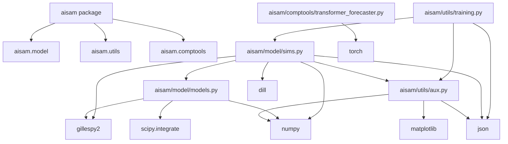
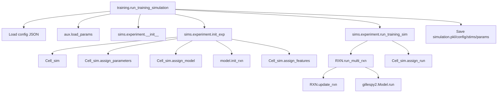
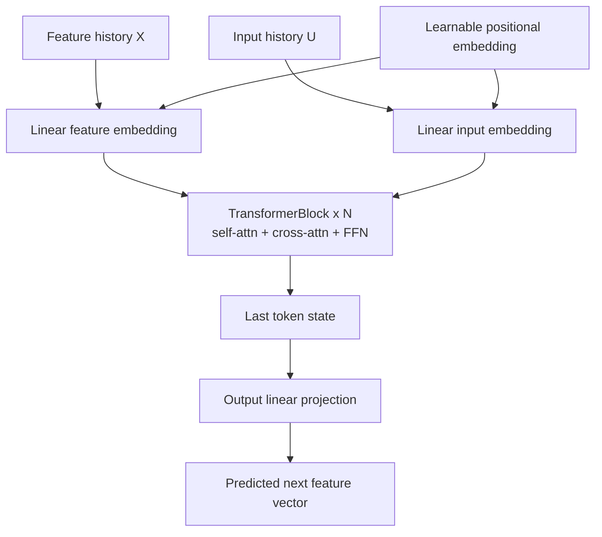

# AISAM: AI scientist for automated microscopy

## Standard training data pipeline

```mermaid
graph TD
    root[root_folder]
    cfg[config.json<br/>circuit/label<br/>t_max<br/>sampling<br/>num_realizations<br/>num_cells=1000<br/>output_root optional<br/>random_seed optional]
    params[simulation_params.json<br/>circuit parameters<br/>CcaSR: alpha, k, n, tau_delay, h1, h2, c2, delta<br/>Inverter adds beta, k_tet, n_tet]
    noisy_opts[optional noisy settings<br/>noisy_sims<br/>temperatures]
    model_opts[optional model settings<br/>model type<br/>past/future windows<br/>feature/output species<br/>sample_interval_minutes]

    run[training.run_training_simulation]
    stims[standard 1000-cell stims<br/>1-900 random<br/>901-950 repetitive red-first<br/>951-1000 repetitive green-first]
    sim[standard GillesPy simulation<br/>1000 cells x num_realizations]
    saved[run folder<br/>{label}_{timestamp}<br/>simulation.pkl<br/>simulation_params.json<br/>stims.json<br/>config.json]

    noisy[optional noisy simulations<br/>sample noisy parameter dictionaries<br/>1000 cells each]
    noisy_saved[noisy/sim_i folders<br/>simulation.pkl<br/>simulation_params.json<br/>stims.json<br/>config.json]

    train[optional downstream training<br/>training.training]
    preprocess[forecaster preprocessing<br/>sample input/expression traces<br/>at sample_interval_minutes]
    model[model artifacts<br/>model.pkl<br/>config.json<br/>metrics]

    root --> cfg
    root --> params
    cfg --> run
    params --> run
    noisy_opts --> run
    run --> stims
    stims --> sim
    run --> sim
    sim --> saved
    noisy_opts --> noisy
    saved --> noisy
    noisy --> noisy_saved
    model_opts --> train
    saved --> train
    train --> preprocess
    preprocess --> model
```

## Codebase dependency graph



## Functional call graph (high-level)



## Model architecture (transformer forecaster)


