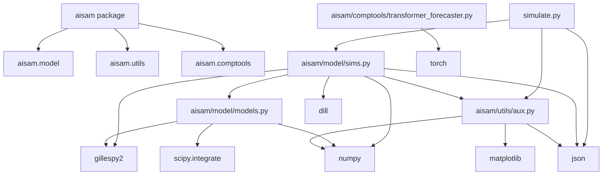
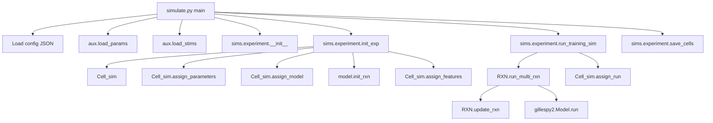
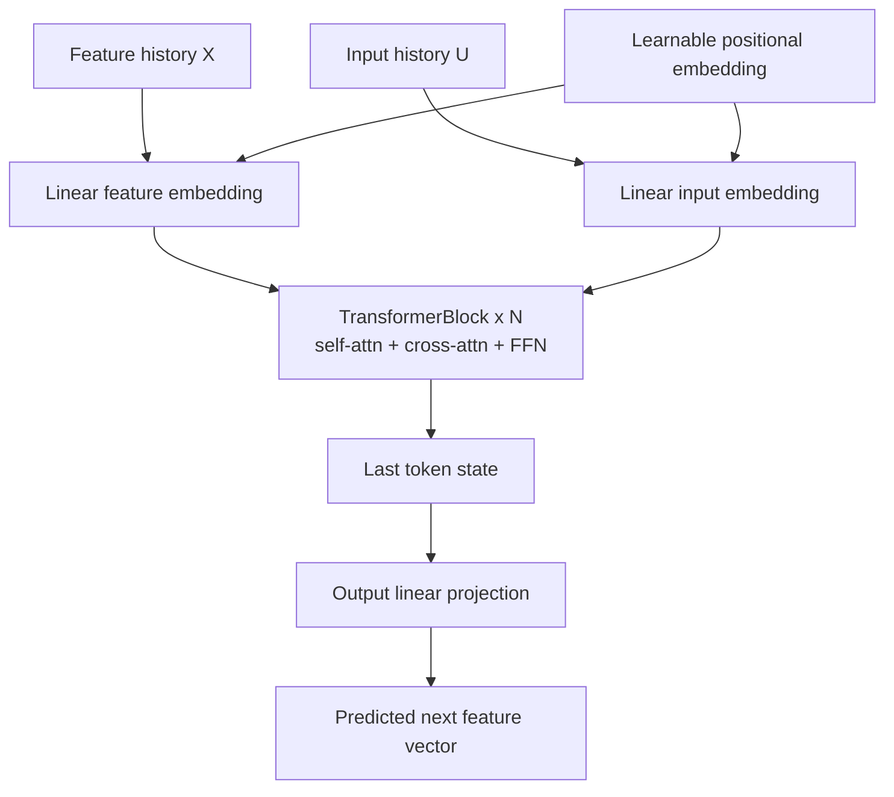

# AISAM: AI scientist for automated microscopy

## Codebase dependency graph

```mermaid
graph TD
    simulate_py[simulate.py]

    aisam[aisam package]
    model_pkg[aisam.model]
    utils_pkg[aisam.utils]
    comptools_pkg[aisam.comptools]

    sims_py[aisam/model/sims.py]
    models_py[aisam/model/models.py]
    aux_py[aisam/utils/aux.py]
    tf_py[aisam/comptools/transformer_forecaster.py]

    gillespy2[gillespy2]
    numpy[numpy]
    scipy[scipy.integrate]
    torch[torch]
    matplotlib[matplotlib]
    dill[dill]
    json[json]

    simulate_py --> sims_py
    simulate_py --> aux_py
    simulate_py --> json

    aisam --> model_pkg
    aisam --> utils_pkg
    aisam --> comptools_pkg

    sims_py --> models_py
    sims_py --> aux_py
    sims_py --> gillespy2
    sims_py --> numpy
    sims_py --> dill
    sims_py --> json

    models_py --> gillespy2
    models_py --> numpy
    models_py --> scipy

    aux_py --> numpy
    aux_py --> matplotlib
    aux_py --> json

    tf_py --> torch
```

## Functional call graph (high-level)

```mermaid
graph TD
    run_cli[simulate.py main]

    load_cfg[Load config JSON]
    load_params[aux.load_params]
    load_stims[aux.load_stims]

    exp_init[sims.experiment.__init__]
    init_exp[sims.experiment.init_exp]
    run_train[sims.experiment.run_training_sim]
    save_cells[sims.experiment.save_cells]

    cell_ctor[Cell_sim]
    assign_params[Cell_sim.assign_parameters]
    assign_model[Cell_sim.assign_model]
    model_init[model.init_rxn]
    assign_features[Cell_sim.assign_features]

    run_multi[RXN.run_multi_rxn]
    update_rxn[RXN.update_rxn]
    gilles_run[gillespy2.Model.run]
    assign_run[Cell_sim.assign_run]

    run_cli --> load_cfg
    run_cli --> load_params
    run_cli --> load_stims
    run_cli --> exp_init
    run_cli --> init_exp
    run_cli --> run_train
    run_cli --> save_cells

    init_exp --> cell_ctor
    init_exp --> assign_params
    init_exp --> assign_model
    init_exp --> model_init
    init_exp --> assign_features

    run_train --> run_multi
    run_multi --> update_rxn
    run_multi --> gilles_run
    run_train --> assign_run
```

## Model architecture (transformer forecaster)

```mermaid
graph TD
    X[Feature history X]
    U[Input history U]

    feat_embed[Linear feature embedding]
    inp_embed[Linear input embedding]
    pos[Learnable positional embedding]

    block1[TransformerBlock x N\nself-attn + cross-attn + FFN]
    last[Last token state]
    out_proj[Output linear projection]
    y[Predicted next feature vector]

    X --> feat_embed
    U --> inp_embed
    pos --> feat_embed
    pos --> inp_embed

    feat_embed --> block1
    inp_embed --> block1
    block1 --> last
    last --> out_proj
    out_proj --> y
```
