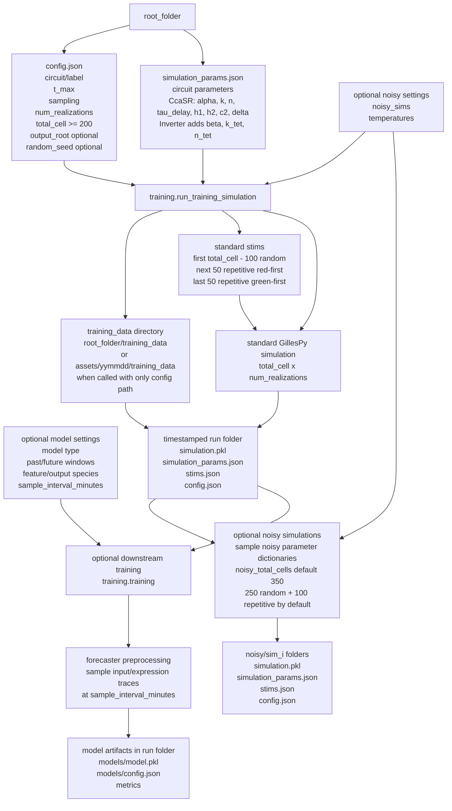
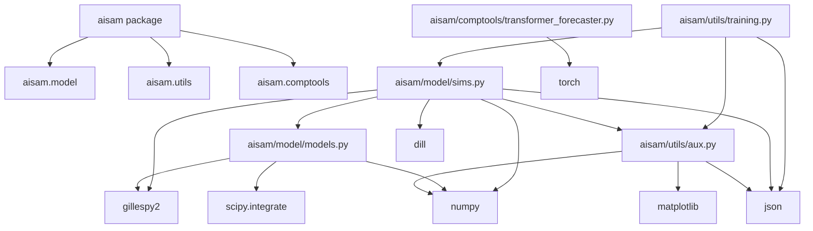
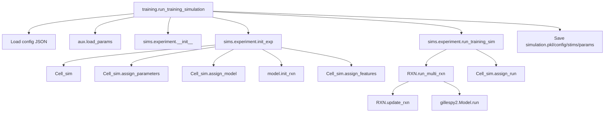
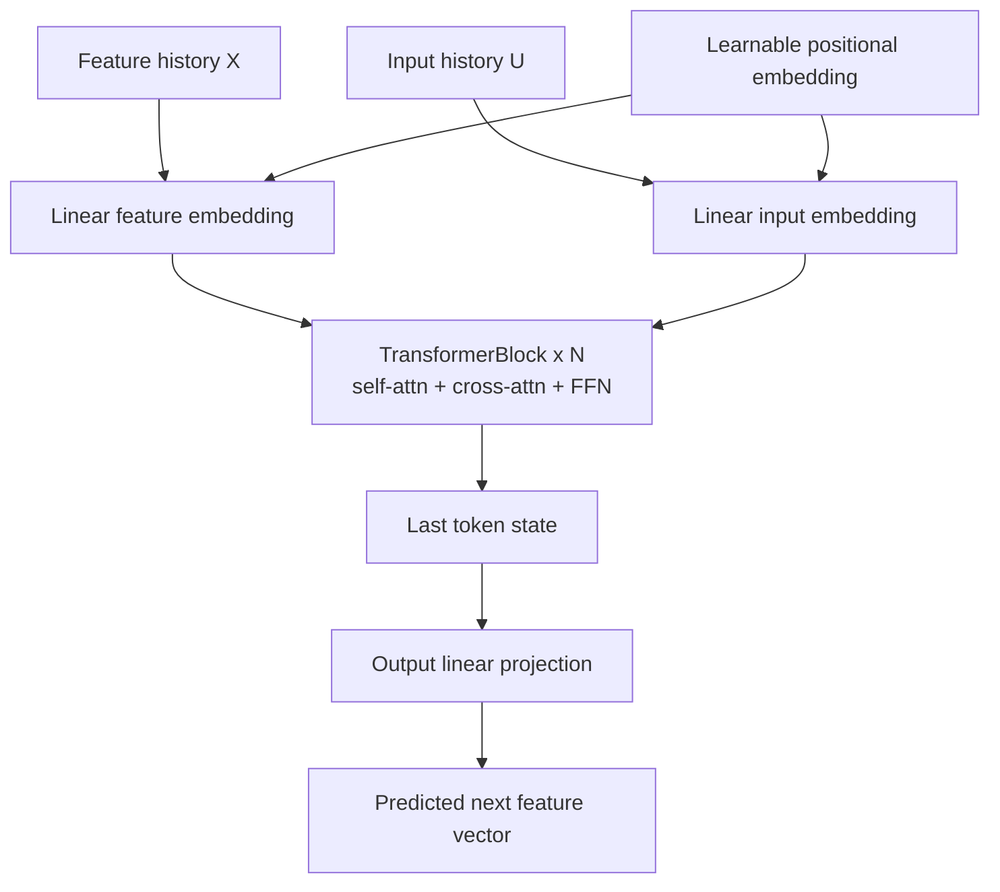

# AISAM: AI scientist for automated microscopy

## Standard training data pipeline



## Example CcaSR pipeline

For a full CcaSR standard simulation with optional noisy simulations and a regression forecaster, the user supplies a root folder containing:

- `config.json`: run settings such as `circuit`, `label`, `t_max`, `sampling`, `total_cell`, `num_realizations`, optional `noisy_sims`, optional `noisy_total_cells`, optional `temperatures`, and optional model settings.
- `simulation_params.json`: CcaSR parameters `alpha`, `k`, `n`, `tau_delay`, `h1`, `h2`, `c2`, and `delta`.

Minimal example `config.json`:

```json
{
  "circuit": "ccasr",
  "label": "ccasr",
  "t_max": 960,
  "sampling": 10,
  "total_cell": 1000,
  "num_realizations": 3,
  "root_folder": "/path/to/run_root",
  "noisy_sims": 2,
  "noisy_total_cells": 350,
  "temperatures": [0.05, 0.1],
  "sample_interval_minutes": 5,
  "model": {
    "type": "regressor",
    "past_feature_window": 20,
    "future_window": 1,
    "output_species": "F"
  }
}
```

Example `simulation_params.json`:

```json
{
  "alpha": 0.1,
  "k": 0.4851,
  "n": 3.6,
  "tau_delay": 12,
  "h1": 0.07100805,
  "h2": 0.0303,
  "c2": 0.0631,
  "delta": 0.01
}
```

Run the full pipeline:

```python
from aisam.utils.training import training

result = training("/path/to/run_root")
```

The standard simulation is saved under `root_folder/training_data/{label}_{timestamp}/`. If `noisy_sims` is greater than zero, noisy simulations are saved under that run folder in `noisy/sim_i/`. The forecaster model is trained only on the standard simulation data from the standard pipeline, then saved under the same run folder in `models/`.

## Codebase dependency graph



## Functional call graph (high-level)



## Model architecture (transformer forecaster)


